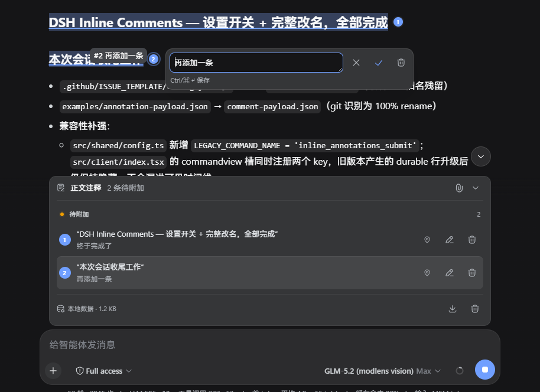
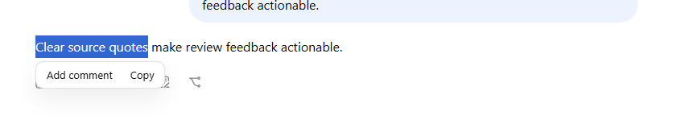
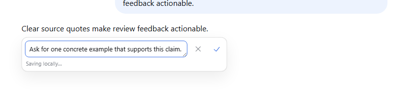
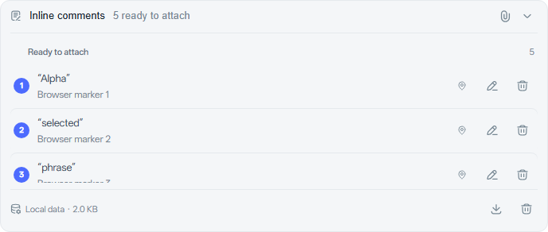
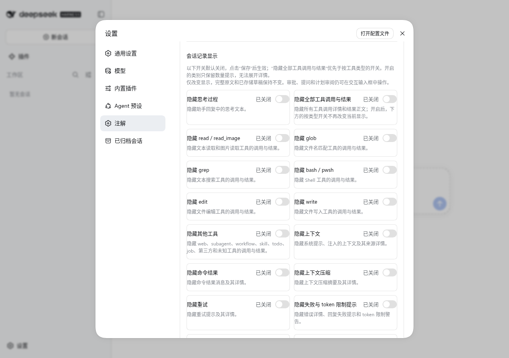

# DSH Annotation

Package name: `dsh-annotation`

[简体中文](README.md)

[](https://github.com/ruisenbai/dsh-annotation/actions/workflows/ci.yml)
[](https://github.com/ruisenbai/dsh-annotation/releases)
[](LICENSE)
[](package.json)

Long AI replies are much easier to review when each note can sit beside the exact sentence it belongs to. dsh-annotation lets you highlight a passage, write feedback in place, collect several annotations, and send them together with text and images through DSH's normal composer. The model then answers each annotation in order under an "Annotation N:" heading, and the Client overlays a hoverable chip on every per-annotation reply.

> **Interaction origin:** this plugin is an independent, unofficial recreation of ChatGPT's inline commenting feature for DeepSeek Harness. It copies the workflow, not OpenAI source code, assets, APIs, or branding, and it is not affiliated with or endorsed by OpenAI.

> **Compatibility:** this project requires DeepSeek Harness `0.1.1-rc.2` or a later `0.1.x` prerelease. DSH is pre-release software. Because DSH does not yet expose an inline assistant-body slot, the plugin decorates the existing assistant renderer in place without occupying `assistant-step`; user and steering rows still use priority shadowing. Review [Compatibility](docs/compatibility.md) before upgrading DSH.

## Preview

The complete workflow stays inside the conversation: select a quote, leave one or more numbered annotations, review the drafts, and send them from the familiar DSH composer.



Highlight the exact words you want to discuss; the browser selection remains available for copying.



Write the note right beside the quote while its context is still on screen.



Review and adjust all local drafts before attaching them to the official composer.



Need a break from annotations? Turn the feature off under **Settings → Plugins → Plugin configuration** without deleting your drafts.



## Features

- Select text inside one finalized assistant reply to open a small action bar with Add annotation and Copy. The blue selection stays alive, so Ctrl+C keeps working until a button is chosen.
- Type directly in the compact selection-positioned input with icon-only Cancel and Save actions. An empty outside click closes it; a dirty outside click keeps it open, turns the input red, and shakes it until one action is chosen.
- Autosave unfinished editor text after 400 ms, display its local-save state, and restore it after a refresh without treating it as a submitted annotation.
- The editor handles Chinese input methods end to end: Enter during composition only confirms the candidate, the Enter produced right after compositionend never saves, a plain Enter saves, Shift+Enter inserts a newline, Escape during composition does not close the editor, and composition events never reach the official composer.
- After a new annotation saves, the Client waits one microtask plus one frame and returns focus and the previous caret position to the official composer. Save failures, cancel, Session switches, and edits to existing annotations never grab focus, and the composer text is never overwritten.
- Group two-line rows into ready-to-attach, delivery-outcome/retry, authoritatively queued, and sent sections; use official DSH buttons, state dots, icons, tooltips, and Toasts.
- Saving a new annotation attaches it to the official composer by default. Turn automatic attachment off in Plugin configuration when preferred, or use the header paperclip at any time. Toggling neither expands nor sends; armed annotations follow the live draft set until the official composer submits.
- Use the official composer as the only task input and Send surface. Ordinary text plus annotations plus images, or annotations alone, produce one task and one model execution.
- Text, annotations, and images travel in one submission: the internal command declares `images = true`, images ride the rc.2 standard command attachments through the official attachment channel (base64 never enters the annotation JSON or the internal command string), and the Host builds one user message as overall requirement + numbered annotations + official image blocks.
- Success clears the text and images and marks the annotations sent. Failure retains the text, images, and annotations; retries reuse the same submission id, and the Host keeps only the first successful result per submission id.
- The outbox stores only image count, media types, and a summary — never base64. After a refresh, when the images cannot be recovered, the plugin refuses to silently resubmit without images and prompts the user to re-select the same images or discard the pending record.
- Slash commands are released automatically: while attached, composer content starting with `/` releases the official input claim and removes the zero-width token, so `/goal`, `/model`, and friends run through the rc.2 official pipeline; leaving command state re-attaches. `claim.submit()` re-checks slash commands to defeat the Enter race — a raced command routes through the official Session command interface without creating an outbox, sending annotations, or marking them sent, and a failed command keeps its text, images, and annotations.
- Per-annotation model replies: the Host prompt asks the model to answer each annotation in order, start every paragraph with "Annotation N:", never merge annotations, emit a hidden `dsh-annotation-reply` marker before each paragraph, and end with the `dsh-annotation` acknowledgement marker. The Client locates each "Annotation N" by text Range and overlays a React chip; hovering or keyboard focus shows the annotation number, the selected source text, and the user's annotation.
- Reply markers only control display: the Client accepts only submissionId + annotationId pairs that exist in the current Session, ignores unknown, duplicate, forged, and malformed markers, keeps plain "Annotation N" text when the model breaks format, associates multiple batches in one reply by annotationId, and never mutates business state from reply markers — only acknowledgements update the processed status.
- The custom user node shows the overall requirement, the annotation summary box, and official image thumbnails through the official image viewer.
- Match the official Web assistant flow, reasoning disclosure, stopped marker, composer docks, icon-action geometry, form typography, semantic colors, floating surfaces, and user-message bubbles while retaining the original map-pin glyph for Locate source.
- Undo one draft deletion, export current-Session recovery JSON, clear unsubmitted drafts, and inspect local storage usage from the composer list.
- Preserve the exact quote, prefix/suffix selector, assistant message id, event sequence, annotation id, and submission id.
- Capture language and line coordinates for code, or row/column coordinates for tables.
- Merge overlapping selections into the existing draft instead of stacking ambiguous highlights.
- Preserve the official composer's submission policy; annotation command admission uses one idempotent queued user message.
- Report authoritative queue, durable send, and retryable failure outcomes through distinct DSH Toasts; withdrawal appears only while the batch remains in the observed queue.
- Render submitted annotation batches as collapsed timeline cards with source navigation.
- Place numbered markers after the complete endpoint line, reserve an overflow-safe gutter, retain ascending order, and coalesce layout updates across reasoning disclosure, viewport, font, and zoom changes.
- Open a preview directly below a clicked body marker; editing or supplementing from that preview remains anchored below the same marker through scrolling and zoom, while edits started from the summary box stay inline. Editing a draft from its marker retains the undo-backed delete action.
- Center the exact numbered-marker line in the active conversation or window viewport when locating source text, including CSS zoom correction.
- Persist unsent drafts, unfinished editor text, and immutable retry records in browser `localStorage`.
- Deduplicate retries across transport failures with a stable submission-derived message id.
- Advance `sent` to `processed` only when the model explicitly returns annotation ids in the requested acknowledgement marker.
- Fall back to numbered markers when the CSS Custom Highlight API is unavailable.

## Quick start

### Build from a clone

```bash
git clone https://github.com/ruisenbai/dsh-annotation.git
cd dsh-annotation
corepack enable
pnpm install
pnpm verify
```

Install the built folder into a Web profile:

```bash
dsh plugin --profile web add .
dsh web --profile web
```

Open the DSH Web URL and select text in a finalized assistant reply. A small action bar appears with Add annotation and Copy; the selection stays alive so Ctrl+C also works. Choose Add annotation to open the compact input, type the note, and press Enter or use its check icon to create the draft. Drafts appear above and attach to the official composer by default. Enter optional task text, attach images, then use the official Enter key or Send button to submit text, annotations, and images together. Turn automatic attachment off in Plugin configuration if desired; the header paperclip remains available for manual attachment. While attached, a slash command temporarily releases the claim: the command runs normally and the annotations are kept.

### Install a GitHub release

Each `v*.*.*` tag builds an installable tarball and attaches it to GitHub Releases. Download it and install the prebuilt package without running repository build scripts:

```bash
gh release download v0.2.3 --repo ruisenbai/dsh-annotation --pattern '*.tgz'
dsh plugin --profile web add ./dsh-annotation-0.2.3.tgz
```

A pinned Git dependency also works when the profile explicitly allows this trusted package to run its `prepare` build:

```bash
dsh plugin --profile web add git+https://github.com/ruisenbai/dsh-annotation.git#v0.2.3
```

## Settings

**Settings → Plugins → Plugin configuration** contains an expandable **dsh-annotation** card with two switches: plugin enablement and automatic composer attachment for new annotations. Both default to on. Edits remain staged until **Save** writes the Host's `dsh-annotation` settings namespace, then apply to every Session served by that Host. Disabling the plugin removes the assistant decoration and restores the user renderers, removes the selection action bar, markers, annotation list, annotation action, hidden transport view, and composer attachment, and preserves visible composer text. Drafts, unfinished editor text, outbox state, and submitted history remain stored and return when the switch is enabled again. Disabling automatic attachment leaves new annotations as local drafts; the header paperclip still attaches them manually.

**Reset to default** clears the selected field's user-layer override and restores its on-by-default value. The DSH settings provider persists both settings. During the rename upgrade, user values from the legacy `inline-comments` settings namespace migrate into the new namespace, and the legacy section is cleared only after the new write succeeds. On the first 0.1.3 load, a valid legacy browser enablement switch remains effective until the Host accepts it, then its old key is removed. Per-Session annotation drafts remain browser-local as described under [Privacy and persistence](#privacy-and-persistence).

## Delivery behavior

Automatic attachment is on by default, so saving a new annotation immediately arms the paperclip. Unarmed annotations remain browser-local and editable. Armed annotations follow the live unsent set: edits, deletions, and new drafts apply until the official composer submits through Enter or Send. The submit transaction then freezes one immutable payload, clears the official draft only after command success, and leaves later annotations for the next task. Clicking the paperclip manually attaches or detaches without changing text, cursor position, or panel expansion.

Transport acceptance is not presented as queue admission. The queued Toast appears only after `ConversationSnapshot.queue` contains the stable message id, and its withdrawal control remains available only in that state. A durable `user/message` changes the result to sent and removes withdrawal. A failed transaction retains the official draft, images, armed state, immutable payload, and submission id for retry.

Regardless of the automatic-attachment switch: slash commands never carry annotations, input-method word selection never triggers a send, and a failed send never loses data.

Existing values written into the removed plugin-owned overall-request field migrate into the official composer on the first successful attachment. The value is cleared from plugin storage only after the composer accepts the claim.

## States

- **Draft:** editable and browser-local.
- **Queued:** admitted to the DSH inbox but not yet present in model history.
- **Sent:** reconstructed from the durable annotation `user/message` event.
- **Processed:** set only after a model response contains the exact submission and annotation ids in the machine acknowledgement.

The plugin never marks an annotation processed from elapsed time, turn completion, or UI timing.

## Configuration

The bundle inserts one `dsh-annotation` row. Override its `config` values in the active profile composition if necessary:

| Key                           |             Default | Purpose                                                            |
| ----------------------------- | ------------------: | ------------------------------------------------------------------ |
| `commandName`                 | `annotation_submit` | Internal browser-to-Host transport command name                    |
| `maxPayloadBytes`             |            `524288` | Maximum decoded JSON batch size; text is rejected, never truncated |
| `maxAnnotationsPerSubmission` |               `100` | Maximum annotations in one batch                                   |
| `warnSelectionChars`          |             `12000` | Require an extra confirmation for a long quote                     |
| `locateHistoryPages`          |                `20` | Maximum older-history pages loaded during source navigation        |

Changing `commandName` must change the same dual-face row used by Host and Client; the shared Cordis row passes one configuration to both halves. Legacy internal commands left behind by the upgrade (`inline_comments_submit`, `inline_annotations_submit`) are forwarded to the new handler through invisible compatibility aliases; no second business implementation is retained.

## Protocol and compatibility

New submissions only emit protocol v2 (`protocolVersion: 2`, `source: "dsh-annotation"`, and the `annotation` field). Legacy v1 data is still read, and the old `comment` field converts into the new internal model. Historical messages are never rewritten; legacy acknowledgement and reply markers are still recognized, and new messages only emit `dsh-annotation-*` markers. Local storage uses the `dsh-annotation:v1:<session-id>` namespace: startup prefers the new storage, otherwise it validates, converts, and writes the legacy storage before deleting the old keys. See [Compatibility](docs/compatibility.md) and [Data model](docs/data-model.md).

## Privacy and persistence

Unsent quotes, annotations, unfinished editor text, and retry records stay in `localStorage` under `dsh-annotation:v1:<session-id>`. When the current key is absent, valid data under `dsh-inline-comments:v1:<session-id>` or `dsh-inline-annotations:v1:<session-id>` is validated, converted, and written to the new key; the legacy keys are removed only after the write succeeds. The visible key remains `v1` while its validated value uses `storageVersion: 2`; version-one values migrate on read. Local data is not sent to the Host or model until the user submits through the official composer. Submitted quotes and annotations become part of the current Session log and model context. Images persist through the official DSH attachment channel; annotation data never stores image bytes. The plugin has no analytics, telemetry, or external network client. See [Privacy](docs/privacy.md).

## Model experience

- **Before submission:** no prompt, token, or KV-cache effect.
- **On submission:** one standard user message contains the official composer text, complete annotation batch, stable ids, source quotes, annotations, structural coordinates, and official image attachments.
- **Per-annotation replies:** the prompt asks the model to answer each annotation in order, start every paragraph with "Annotation N:", and emit a hidden association marker before each paragraph; the Client strips those markers before rendering and overlays annotation chips.
- **Acknowledgement request:** the message asks the model to append one hidden acknowledgement marker listing only annotations it actually handled. The Client strips that marker before rendering while retaining the raw model text for replay.
- **Tokens:** cost scales with the complete selected text and annotations; the plugin does not truncate them. The byte limit rejects oversized batches before admission.
- **KV cache:** steering or follow-up input changes subsequent model context like any other user message.

## Development

```bash
pnpm typecheck
pnpm lint
pnpm test
pnpm exec playwright install chromium
pnpm test:browser
pnpm test:coverage
pnpm build
pnpm verify:bundle
pnpm publint
pnpm pack
```

The CI workflow runs type checking, linting, unit tests, a production bundle, artifact verification, and publint on Node 22.19 and 24. The Node 24 job also runs the real Chromium regression and creates the package artifact. See [Development](docs/development.md), [Architecture](docs/architecture.md), and [Data model](docs/data-model.md).

## Known limitations and deferred work

- DSH has no public slot inside assistant Markdown. Through rc.2's `ctx.slots.entries()`, this plugin decorates existing `assistant-step` components in place and composes their inject faces without adding another keyed entry — so it composes with same-style decorators such as dsh-smooth-stream; `user` and `steering` remain priority `-100` shadows. Slot-entry changes require a compatibility review.
- Browser-local drafts do not synchronize between devices or browser profiles. Sent batches reconstruct from the Session log on any client.
- The machine acknowledgement is cooperative. If the model omits or corrupts it, annotations remain `sent` rather than being guessed as processed; if the model breaks the reply format, its "Annotation N" text stays plain.
- After a page refresh, unsent composer images cannot be recovered. Retrying a recorded image batch without images is refused; re-select the same images or discard the pending record.
- Archived tasks have no active composer and cannot arm annotations. Create annotations in an editable task.
- CSS Custom Highlights are browser-dependent. Numbered markers and timeline navigation remain available without them.
- A selection must stay within one assistant reply. Cross-message selections are rejected.
- DSH has no private command-registration flag, so the validated internal transport command may appear in slash-command discovery. The legacy command aliases never appear in the plugin settings page.

## Community

- [Contributing](CONTRIBUTING.md)
- [Code of Conduct](CODE_OF_CONDUCT.md)
- [Security policy](SECURITY.md)
- [Support](SUPPORT.md)
- [Release guide](RELEASING.md)
- [Changelog](CHANGELOG.md)

Released under the [MIT License](LICENSE).
