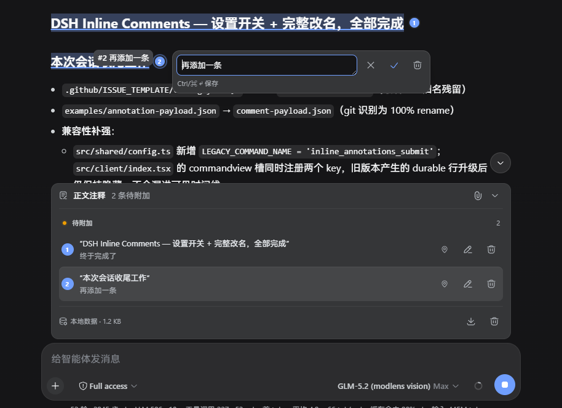
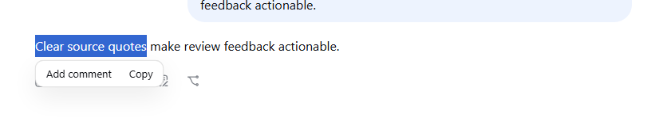
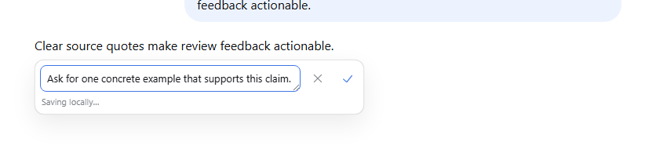
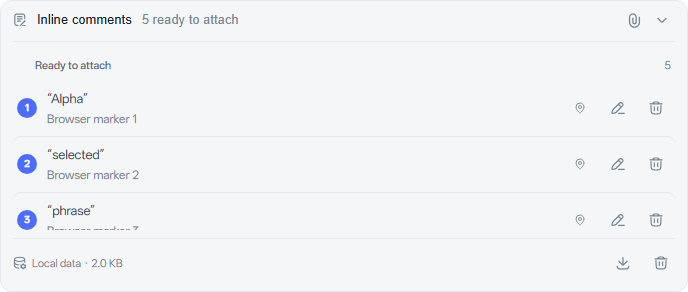
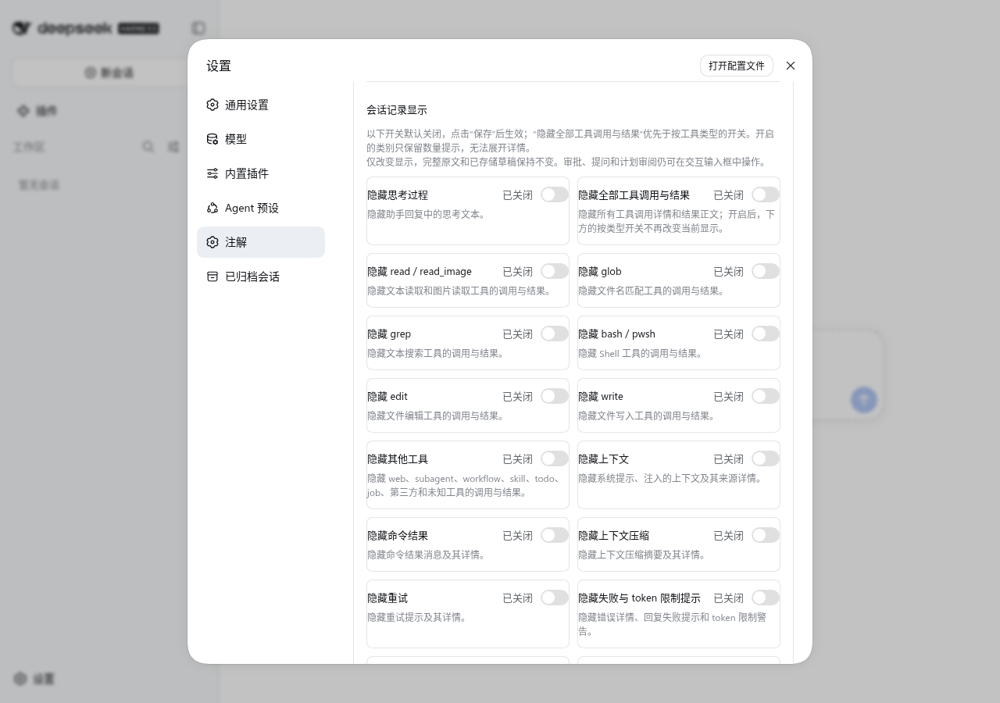

# DSH Annotation

Package name: `dsh-annotation`

[简体中文](README.md)

[](https://github.com/ruisenbai/dsh-annotation/actions/workflows/ci.yml)
[](https://github.com/ruisenbai/dsh-annotation/releases)
[](LICENSE)
[](package.json)

Long AI replies are much easier to review when each note can sit beside the exact sentence it belongs to. dsh-annotation lets you highlight a passage, write feedback in place, choose the batch for the next send, and submit it with text, images, and files through DSH's normal composer. The model can answer annotations individually, produce an integrated rewrite, or revise the annotated target while retaining per-annotation reply navigation.

> **Interaction origin:** this plugin is an independent, unofficial recreation of ChatGPT's inline commenting feature for DeepSeek Harness. It copies the workflow, not OpenAI source code, assets, APIs, or branding, and it is not affiliated with or endorsed by OpenAI.

> **Market category: Sessions & Messages.** The plugin reviews assistant messages within one Session and submits annotated user messages through the official composer; it is not a theme or general appearance plugin.
>
> **Host requirement:** Plugin `0.9.0` (unreleased) requires DSH Web `0.1.6-alpha.2`. The release manifest states this exact requirement through `engines.dsh` and lockstep `@deepseek-ai/dsh-*` peers; desktop clients must embed the same version. DSH is pre-release software, so review [Compatibility](docs/compatibility.md) before upgrading.
>
> **Integration compatibility:** DSH does not expose an inline assistant-body slot. The plugin decorates the existing assistant renderer in place without occupying `assistant-step`; user and steering rows use priority shadowing.

## Preview

The complete workflow stays inside the conversation: select a quote, leave one or more numbered annotations, review the drafts, and send them from the familiar DSH composer.



Highlight the exact words you want to discuss; the browser selection remains available for copying.



Write the note right beside the quote while its context is still on screen.



Review and adjust all local drafts before attaching them to the official composer.



Need a break from annotations? Turn the feature off under **Settings → Annotations** without deleting your drafts.

The dedicated Settings section includes feature enablement, sending new annotations with the next message, individual selection, compact annotation summary, transcript visibility, and optional Market update actions.



## Features

- Select text inside one finalized assistant reply to open a small action bar with Add annotation and Copy. The blue selection stays alive, so Ctrl+C keeps working until a button is chosen.
- Type directly in the compact selection-positioned input with Discard and Save actions. Clicking outside or pressing Escape collapses the editor, retains unfinished content, and does not consume the original click. Resume it from Saved editing drafts or discard it explicitly; discarding an unfinished edit never deletes the previously saved annotation.
- Autosave unfinished editor text after 400 ms, display its local-save state, and restore it after a refresh without treating it as a saved annotation. Multiple unfinished new and edited annotations can coexist, each recovered through a stable draft or annotation identity.
- The editor handles Chinese input methods end to end: Enter during composition only confirms the candidate, the Enter produced right after compositionend never saves, a plain Enter saves, Shift+Enter inserts a newline, Escape during composition does not collapse the editor, and composition events never reach the official composer.
- After a new annotation saves, the Client waits one microtask plus one frame and returns focus and the previous caret position to the official Lexical composer only when the same editor keeps its visible text and the user has not moved focus elsewhere. Save failures, explicit discard, Session switches, and edits to existing annotations never grab focus, and composer text and file-reference chips are never overwritten.
- Group records into unsent annotations, send confirmation, queued items, and history using official DSH buttons, state dots, icons, tooltips, and Toasts; keep internal ids inside expandable diagnostics.
- Send all with message is the default selection mode. Saving a new annotation uses the default-on `autoAttach` setting to arm the official composer; automatic attachment can be disabled, and the header paperclip remains a manual toggle. Only saved drafts without unfinished edits enter the next batch, and the armed set follows saves, deletions, and edit state.
- The default-off Choose annotations individually setting removes implicit selection. In that mode `autoAttach` is ignored and the paperclip is hidden; each saved annotation must be selected explicitly, while unsaved new content and annotations with unfinished edits remain ineligible. Switching between aggregate and individual selection clears the current unsent selection and active retry, detaches the composer with a notice, and leaves drafts and immutable outbox records intact.
- Use the official composer as the only task input and Send surface. Text, annotations, images, and files can be submitted together; annotation-only submissions use the same path.
- Text, annotations, and attachments travel in one submission: the internal command declares `attachments = true`, and the Client sends standard DSH image and file attachments through the Session-addressed `commands/execute` Remote. The Host appends durable image and file blocks to one user message in attachment order. Attachment bytes and temporary file-upload receipts never enter the annotation JSON or command string.
- Clicking Send freezes the eligible selected annotations and processing mode for that attempt; later next-batch selection or setting changes do not rewrite it. If a captured annotation is deleted, changed, or made ineligible by an unfinished edit before outbox creation, the attempt aborts and preserves the latest drafts and composer input instead of restoring stale state. Success advances only that batch; unselected drafts remain for later.
- The immutable outbox records the submission id, processing mode, overall requirement, selected annotations, and target Session. New payloads also freeze Host-preflighted attachment content ids, byte counts, names, types, and order, never raw content or temporary upload receipts. Retry reuses the original payload; after refresh, reselect the same content and names in the same order. Fresh upload receipts for the original file remain valid. Attachment preflight adds one request; failure preserves the composer without creating a send record, and both plugin halves must be updated together. Legacy records remain readable, but those without content identities can only check count and kind order, not same-kind substitutions. If durable history appears after an ambiguous failed record was discarded, it restores only the original id, content, and batch ordinal without retaining later source fields; subsequent local changes survive as new linked, unselected drafts or editor buffers.
- Slash commands are released automatically: while attached, composer content starting with `/` releases the official input claim and removes the zero-width token, so `/goal`, `/model`, and friends run through the official pipeline; leaving command state re-attaches. `claim.submit()` re-checks slash commands to defeat the Enter race — a raced command routes through the Session-addressed command Remote without creating an outbox, sending annotations, or marking them sent, and a failed command keeps its text, attachments, and annotations.
- Choose Answer individually, Integrated rewrite, or Revise by annotation before sending. Answer mode responds to each annotation in order without merging. Rewrite mode produces one coherent body and may combine related feedback. Modify mode must change the annotated target, preserve unaffected parts, and report the result; missing tools, permissions, or materials must be stated explicitly. Every mode keeps brief per-annotation notes under "Annotation N:" headings with hidden `dsh-annotation-reply` markers after the body or result, and `processed` acknowledges only ids actually completed. The overall requirement defines goals, scope, and constraints; the mode defines the deliverable. Direct conflicts require an explanation and clarification.
- Reply markers only control display: the Client accepts only submissionId + annotationId pairs that exist in the current Session, ignores unknown, duplicate, forged, and malformed markers, keeps plain "Annotation N" text when the model breaks format, associates multiple batches in one reply by annotationId, and never mutates business state from reply markers — only acknowledgements update the processed status.
- Custom user and steering nodes show the overall requirement, the annotation summary box, and images and files in their original order. File and skill references retain their official open actions. Images use the official thumbnails and viewer; files show type icons, names, and sizes.
- Empty or whitespace-only notes are saved as Highlight only and shown with that label rather than a blank value. Clearing a saved draft converts it to Highlight only; deletion remains a separate action. The item still participates in selection, submission, retry, and the current processing mode, and the model must not skip it because annotation text is absent.
- Compact annotation summary is on by default: while collapsed, the summary aligns right, sizes to its content, and omits the leading icon. Turning it off and saving restores the full-width bar. Aggregate mode keeps the paperclip; individual mode replaces it with per-item selection buttons. `N selected for this send` counts only eligible annotations carried by the next send or the active retry batch; unfinished edits, unselected drafts, and inactive retry records are excluded. Hover or focus the collapsed count for a read-only overview of numbers, quotes, annotations, and states. Opening upward expands the full list and bottom summary controls to the same safe width and joins them at a one-pixel seam as one card, aligns controls right, and suppresses the redundant overview. One persistent chevron rotates smoothly and the list fades in from its bottom-right anchor; reduced motion disables both transitions. Escape collapses the list and restores focus to the summary trigger. Narrow screens, CSS zoom, internal scrolling, and annotation, delivery, and editor state remain unchanged.
- Freeze `protocolLocale` and `processingMode` when the pending record is created. First send and retry use the same language and output mode even if the current UI choices change. Old records without a locale use English; old records without a processing mode use Answer individually. Hidden stable annotation identities remain authoritative for reply association.
- Match the official Web assistant flow, reasoning disclosure, stopped marker, composer docks, icon-action geometry, form typography, semantic colors, floating surfaces, and user-message bubbles while retaining the original map-pin glyph for Locate source.
- Delete individual drafts and undo the most recent deletion. The annotation summary has no local-storage usage, export/download, or bulk-clear footer; local autosave and refresh recovery remain available.
- Use official DSH `Switch` and `Tag` primitives in the dedicated **Settings → Annotations** page, and use dsh-market's public update API to check the installed version, install with progress, offer force only after eligible failures, and expose rollback, refresh, or Host restart when supported.
- Preserve the exact quote, prefix/suffix selector, assistant message id, event sequence, annotation id, and submission id.
- Capture language and line coordinates for code, or row/column coordinates for tables.
- Overlapping selections never choose a target implicitly. Create an independent annotation or explicitly choose one annotation to supplement. Supplementing an unsent draft appends the new text to its saved note; when the quote changes, the editor shows the old and new ranges and updates the range on save. If that target already has an unfinished edit, the previous buffer resumes with a finish-or-discard notice and the new supplement is not merged automatically. Supplementing a queued, sent, or processed annotation creates a new annotation id linked through `supplementalTo` without rewriting frozen history.
- Preserve the official composer's submission policy; annotation command admission uses one idempotent queued user message.
- Report authoritative queue, durable send, and retryable failure outcomes through distinct DSH Toasts; withdrawal appears only while the batch remains in the observed queue.
- Render submitted annotation batches as collapsed timeline cards with source navigation.
- Place markers only in existing safe space after the endpoint line, without reserving a body gutter or changing padding. Multiple annotations on one visual line share a single ×N marker with members ordered by ordinal; annotations without safe space or a restored range remain accessible from the summary. Highlights stay faint, with stronger emphasis only for active annotations, and ordinary body hover or clicks do not open previews. Coalesce layout updates across reasoning disclosure, viewport, font, and zoom changes.
- Clicking a marker opens its preview. Previews and body-anchored editors use measured viewport, scroll-container, and official-composer bounds: existing side space first, then below or above, with a safely bounded scrollable panel on narrow screens or when space is insufficient. Placement follows scrolling and supports 125%/200% CSS zoom. Summary-started edits stay inline, draft editing retains undo-backed deletion, outside clicks and Escape suspend unfinished content, and IME composition never causes an accidental collapse or save.
- When locating source text, including from a model-reply label, expand it first only when it is actually inside a folded Turn container, center the complete quote in the active conversation or window viewport with CSS zoom correction, and show one smoothly fading background over the quote range. A newer navigation cancels the earlier transient effect without clearing persistent marker or editor highlights.
- Restore unsent drafts, multiple suspended editors, individual selections, the processing mode, active retry, and immutable outbox from browser `localStorage`; validated storage v1/v2 records migrate to v3 with defaults, while v2 retry payloads stay v2 and v1 retains its existing normalization to v2.
- Deduplicate retries across transport failures with a stable submission-derived message id.
- Advance `sent` to `processed` only when the model explicitly returns annotation ids in the requested acknowledgement marker.
- Fall back to numbered markers when the CSS Custom Highlight API is unavailable.

## Real code Diff annotations

Choose **Annotate code Diff** in the annotation/composer area, select Working tree or Staged, and choose an actual Git change. This is a plugin-owned entry point, not a button added to better-sidebar or the Host Changes tab.

1. Click `+` beside an old/new line number. Keyboard users can focus it and press Enter; Shift-click or Shift+Enter on another line on the same side selects a continuous range.
2. Check the file, side, file line numbers and code quote, then save an opinion. Deleted lines belong to the old side and added lines to the new side. Each side counts independently and cannot be merged into one range.
3. A marker stays beside the line number and the opinion joins the existing summary. Editor buffers, individual selection, processing modes and history are shared with message annotations; saving a Diff annotation never implicitly selects all items in individual mode.
4. Return to the official composer, select this send's annotations and submit. One message can mix message and Diff annotations; unselected items remain drafts.
5. **Locate source** opens the complete original snapshot and unfolds the recorded side and line. Later worktree or index changes do not move it. **Check current location** only proposes a reliable candidate; an explicit rebind creates a supplement and retains the original source.

Working tree compares index with captured working content; Staged compares captured HEAD with index, without cross-range fallback. The first interface is unified-only. Binary files, links, submodules, incomplete sources and over-limit content explicitly lack precise text anchors; empty files have no invented line 1. Commit-history and branch comparisons are not integrated.

**Code retention:** Diff previews record complete file sides in Host command results. Submitted sources also retain those snapshots in Session history. Opinion text remains browser-local before submission. See [privacy](docs/privacy.md), [source data](docs/data-model.md#diff-source) and [supported scope](docs/compatibility.md#diff-compatibility-and-persistence-acknowledgement).

## Install

### Requirements

- DSH Web `0.1.6-alpha.2` exactly (run `dsh --version`; for a desktop client, also check its embedded host version)
- Node.js `^22.19.0` or `>=24.0.0`
- A `web` profile

When `dsh --version` differs, choose the mapped plugin release below or change to the required host version; do not bypass the version constraint with a forced install or disabled peer checks.

### Install a GitHub release (recommended)

Published GitHub Releases contain prebuilt tarballs that need no local build. The stable alias below points at the latest published release, not the unreleased `0.9.0`; check that release's host requirement before installing. Use the source-build procedure below to verify `0.9.0`:

```bash
curl -fL -o dsh-annotation.tgz https://github.com/ruisenbai/dsh-annotation/releases/latest/download/dsh-annotation.tgz
dsh plugin --profile web add ./dsh-annotation.tgz
dsh web
```

Restart DSH Web after installation when it is already running. Unreleased `0.9.0` targets DSH `0.1.6-alpha.2`. Historical mapping: `v0.8.0` targets DSH `0.1.5-alpha.1`; `v0.7.0` targets DSH `0.1.3-alpha.2`; `v0.6.0` targets DSH `0.1.3-alpha.1`; `v0.5.2`, `v0.5.1`, and `v0.5.0` target DSH `0.1.2-rc.1`; `v0.4.0` targets DSH `0.1.2-alpha.3`; `v0.3.0` targets DSH `0.1.2-alpha.1`; `v0.2.4` targets DSH `0.1.1-rc.2`.

### Build from a clone

Source builds require the complete DSH `0.1.6-alpha.2` dependency family. Prepare the matching dependencies and run the checks in the [development guide](docs/development.md#install-and-verify). Dependencies unavailable from npm must come from verifiable official source or official artifacts and must be built and installed in a disposable directory; never commit machine-local `file:` paths or a temporary lockfile to the release manifest.

Open the DSH Web URL and select text in a finalized assistant reply. A small action bar appears with Add annotation and Copy; the selection stays alive so Ctrl+C also works. Choose Add annotation, type the note, and press Enter or use the check icon to save it; Escape or an outside click suspends it for later. Default aggregate mode automatically attaches eligible drafts to the official composer. Choose the processing mode, enter optional task text, attach images or files, then use the official Enter key or Send button. To pick a subset, enable Choose annotations individually in Settings and explicitly select this batch above the composer. While attached, a slash command temporarily releases the claim: the command runs normally and the annotations are kept.

## Settings

The dedicated **Settings → Annotations** section defaults plugin enablement (`enabled`), Send new annotations with the next message automatically (`autoAttach`), and Compact annotation summary (`compactSummary`) to on. Choose annotations individually (`individualSelection`) and every transcript-hiding switch default to off. Edits remain staged until **Save** is accepted by the Host, then apply to every Session it serves. Disabling the plugin removes annotation UI and composer attachment while preserving visible composer text, drafts, multiple suspended editors, outbox, and history. In aggregate mode, disabling automatic attachment leaves the paperclip available; individual mode always ignores `autoAttach`, hides the paperclip, and never implies select all. Switching aggregate or individual mode clears the current selection and active retry, detaches the composer with a reselect notice, and leaves existing outbox records unchanged. Disabling Compact annotation summary only restores the full-width layout and leading icon.

**Reset to default** clears the selected field's user-layer override and restores its declared default; hiding switches reset to off. The DSH settings provider persists all settings. Stored `localTools` user overrides are ignored without deletion or migration, and existing annotation data is not cleared. During the rename upgrade, user values from the legacy `inline-comments` settings namespace migrate into the new namespace, and the legacy section is cleared only after the new write succeeds. On the first 0.1.3 load, a valid legacy browser enablement switch remains effective until the Host accepts it, then its old key is removed. Per-Session annotation drafts remain browser-local as described under [Privacy and persistence](#privacy-and-persistence).

The **Plugin update** area in the same form calls only dsh-market's same-origin `dsh-market/update-api/v1` API. The first **Check for updates** action discovers Market capabilities before checking `dsh-annotation`; install, rollback, and Host restart appear only when Market advertises them. **Update anyway** appears only after a normal attempt fails under an eligible release policy. A live activation can request a page refresh, while desktop- or operator-owned Hosts show no restart button. Without a compatible dsh-market installation, the card directs the user to **Settings → Plugin Market** and never calls a legacy private update route.

### Transcript visibility

The following 18 switches default to off and take effect after **Save**. They use a responsive two-column grid in the main Settings panel and collapse to one column when space is narrow. Enabled categories do not mount their details; they show non-expandable counts such as `think x 3`, `Read x 2`, `Grep x 1`, and `Bash x 2`. Clicking, keyboard input, and browser find cannot reveal hidden details. Turn the corresponding switch off and save to restore them. **Hide all tool calls and results** overrides the named tool switches; **Hide other tools** covers every remaining built-in, third-party, MCP, or unknown tool name.

| Switch                                            | Setting                 | Hidden content                                                                            |
| ------------------------------------------------- | ----------------------- | ----------------------------------------------------------------------------------------- |
| Hide reasoning                                    | `hideReasoning`         | Assistant reasoning                                                                       |
| Hide all tool calls and results                   | `hideTools`             | Every tool argument, result, and nested-call detail                                       |
| Hide `read` / `read_image`                        | `hideToolRead`          | Text- and image-reading tool calls and results                                            |
| Hide `glob`                                       | `hideToolGlob`          | File-name matching calls and results                                                      |
| Hide `grep`                                       | `hideToolGrep`          | Text-search calls and results                                                             |
| Hide `bash` / `pwsh`                              | `hideToolBash`          | Shell calls and results                                                                   |
| Hide `edit`                                       | `hideToolEdit`          | File-editing calls and results                                                            |
| Hide `write`                                      | `hideToolWrite`         | File-writing calls and results                                                            |
| Hide other tools                                  | `hideToolOther`         | Web, subagent, workflow, skill, todo, job, third-party, and unknown tools                 |
| Hide context                                      | `hideContext`           | Injected context and system prompts                                                       |
| Hide command results                              | `hideCommandResults`    | Command result messages                                                                   |
| Hide context compaction                           | `hideCompaction`        | Automatic and manual compaction summaries                                                 |
| Hide retries                                      | `hideRetries`           | Retry notices and reasons                                                                 |
| Hide failure and token-limit notices              | `hideErrors`            | Errors, truncation, and interruption notices                                              |
| Hide images and files                             | `hideAttachments`       | Message image/file attachments, not Markdown images inside body text                      |
| Hide submitted annotation details                 | `hideAnnotationHistory` | Annotation detail lists in user messages, without deleting drafts or history              |
| Hide completed-reply statistics and action footer | `hideTurnDetails`       | Statistics and standard copy, fork, and annotation actions; extension-only actions remain |
| Hide other details                                | `hideOther`             | Unknown content blocks and workflow details                                               |

Assistant activity is grouped within each loaded turn: each reasoning block counts once, tool calls including nested calls are deduplicated by call ID and grouped by name, and retries count attempts. A named tool filter removes matching tool heads and results while preserving visible sibling calls. When a selected root call owns nested calls, its whole card is hidden and every concealed call remains represented in the summary. Summaries update during streaming and history loading. User attachment/annotation summaries and events outside a turn stay beside their own message. Ordinary human text, steering instructions, and assistant body text are never removed by these switches.

While any hiding switch is active, Chat temporarily uses the full-body layout so its Compact mode cannot also conceal intermediate prose. Turning all hiding switches off restores the current Chat preference without writing that preference. These switches affect Chat presentation only, not the session log, model input, or stored annotation data. Approval, question, plan-review, running-status, and history-loading controls remain available.

## Delivery behavior

Default aggregate mode treats every saved draft without unfinished edits as the next batch. `autoAttach` defaults to on, and the paperclip manually attaches or detaches. Individual mode defaults to off; when enabled it never implies select all, sends only explicitly selected eligible annotations, leaves the rest for later, and ignores both `autoAttach` and the paperclip. Switching selection mode clears the unsent selection and active retry and detaches the composer without changing drafts or outbox.

Choose Answer individually, Integrated rewrite, or Revise by annotation before sending. Preparation freezes the selected set with contiguous batch ordinals, processing mode, overall requirement, protocol locale, target Session, and attachment order; unfinished new or edited content cannot enter the batch. Next-batch selection or setting changes do not rewrite the clicked snapshot; the attempt aborts and preserves current state only when a captured annotation is deleted, changed, or becomes ineligible before outbox creation. A failed record can retry only its original submission id, payload, mode, and attachment metadata. Selecting fresh drafts releases the active retry without deleting it, while selecting a retry clears the fresh batch selection. If it later becomes queued, accepted, or sent, a stale retry action skips transmission without downgrading state; a withdrawn record aborts.

Transport acceptance is not presented as queue admission. An independent subscription to `session.projections.faceOf('inbox')` confirms queue admission only when a `next-turn` item's `id` matches the stable message id; only that placement exposes the queued Toast and withdrawal control. `next-step` items are not withdrawable queue entries. An `undefined` projection means not yet synchronized, not an empty queue, and cannot establish that an observed item departed. A durable `user/message` in the Chat target changes the result to sent and removes withdrawal. A failed transaction retains the official draft, images and files, armed state, immutable payload, and submission id for retry.

Regardless of the automatic-attachment switch: slash commands never carry annotations, input-method word selection never triggers a send, and a failed send never loses data.

Existing values written into the removed plugin-owned overall-request field migrate into the official composer on the first successful attachment. The value is cleared from plugin storage only after the composer accepts the claim.

## States

- **Draft:** saved, editable, and browser-local; a draft with an unfinished edit is temporarily ineligible, and suspended new content is not yet a saved draft.
- **Queued:** observed as a DSH Inbox `next-turn` item but not yet present in model history.
- **Sent:** reconstructed from the durable annotation `user/message` event.
- **Processed:** set only after a model response contains the exact submission and annotation ids in the machine acknowledgement.

The plugin never marks an annotation processed from elapsed time, turn completion, or UI timing.

## Annotation kinds

- **Note (`note`):** contains text that the model applies under the selected processing mode.
- **Highlight only (`highlight-only`):** contains no non-whitespace note, but the model must still inspect the selected source under the current mode and cannot skip it. Old data without `kind` infers it from content; sent history is never rewritten.

## Configuration

The bundle inserts one `dsh-annotation` row. Override its `config` values in the active profile composition if necessary:

| Key                           |             Default | Purpose                                                            |
| ----------------------------- | ------------------: | ------------------------------------------------------------------ |
| `commandName`                 | `annotation_submit` | Internal browser-to-Host transport command name                    |
| `maxPayloadBytes`             |            `524288` | Maximum decoded JSON batch size; text is rejected, never truncated |
| `maxAnnotationsPerSubmission` |               `100` | Maximum annotations in one batch                                   |
| `maxDiffFileBytes`            |            `131072` | Maximum UTF-8 bytes per Diff side                                  |
| `maxDiffLines`                |              `5000` | Maximum real file lines per Diff side                              |
| `diffTimeoutMs`               |             `30000` | Per-Git-command read timeout in milliseconds                       |
| `warnSelectionChars`          |             `12000` | Require an extra confirmation for a long quote                     |
| `locateHistoryPages`          |                `20` | Maximum older-history pages loaded during source navigation        |

Changing `commandName` must change the same dual-face row used by Host and Client; the shared Cordis row passes one configuration to both halves. Legacy internal commands left behind by the upgrade (`inline_comments_submit`, `inline_annotations_submit`) are forwarded to the new handler through invisible compatibility aliases; no second business implementation is retained.

## Protocol and compatibility

New submissions use protocol v3 with explicit message/Diff source types and retain batch-level `processingMode` plus optional annotation-level `supplementalTo`. `processingMode` accepts only `answer`, `rewrite`, or `modify`; old v1/v2 records without it read as `answer`, while explicit invalid values are rejected. A supplemental target id must be nonblank, bounded, and not self-referential, and may name historical annotation outside the current batch. Compatibility for old `comment`, missing `kind`, and missing `protocolLocale` remains unchanged. Historical messages are never rewritten and legacy markers remain readable. The local key stays `dsh-annotation:v1:<session-id>`, new values use `storageVersion: 3`, and validated v1/v2 state migrates without upgrading frozen retry payloads to v3; v1 retains its existing normalization to v2. See [Compatibility](docs/compatibility.md) and [Data model](docs/data-model.md).

## Privacy and persistence

Unsent quotes, saved annotations, multiple suspended editors, selection and processing state, and immutable retry records stay in `localStorage` under `dsh-annotation:v1:<session-id>`. When the current key is absent, valid data under `dsh-inline-comments:v1:<session-id>` or `dsh-inline-annotations:v1:<session-id>` is validated, converted, and written to the new key; the legacy keys are removed only after the write succeeds. The visible key remains `v1` while its validated value uses `storageVersion: 3`; older values migrate on read. Unsent opinions and editor buffers stay browser-local. Opening a real Diff records its file list or full snapshots in ordinary Host command results but does not invoke the model. Submitting through the official composer records only the selected quotes, version sources and opinions in a standard user message and model context. Images and files persist through the official DSH attachment channel; annotation data never stores attachment bytes or temporary file-upload receipts. The plugin has no analytics, telemetry, or external network client. See [Privacy](docs/privacy.md).

## Model experience

- **Before submission:** no prompt, token, or KV-cache effect.
- **On submission:** one standard user message contains the official composer text, selected annotation batch, stable ids, source quotes, annotations, supplemental links, processing mode, structural coordinates, and official image and file attachments.
- **Output form:** `answer` responds individually without merging; `rewrite` produces one coherent body that can integrate related feedback; `modify` changes the annotated target and reports the result or states the execution blocker. Every mode retains hidden association markers and brief per-annotation notes, and Highlight only items still require handling under the selected mode.
- **Acknowledgement request:** the message asks the model to acknowledge only ids actually completed in this response, never the full batch by default. The Client strips that marker before rendering while retaining the raw model text for replay.
- **Tokens:** cost scales with the complete selected text and annotations; the plugin does not truncate them. The byte limit rejects oversized batches before admission.
- **KV cache:** steering or follow-up input changes subsequent model context like any other user message.

## Development

```bash
pnpm typecheck
pnpm lint
pnpm test
pnpm exec playwright install chromium
pnpm test:browser
pnpm test:coverage
pnpm build
pnpm test:profile
pnpm verify:bundle
pnpm publint
pnpm pack
```

The CI workflow runs type checking, linting, unit tests, a production bundle, artifact verification, and publint on Node 22.19 and 24. The Node 24 job also runs the Chromium fixture regression and a separate real-profile smoke, then creates the package artifact. `pnpm test:profile` requires plugin artifacts from `pnpm build` or `pnpm verify`; these are verification requirements, not a claim that `0.9.0` has passed them. See [Development](docs/development.md), [Architecture](docs/architecture.md), and [Data model](docs/data-model.md).

## Known limitations and deferred work

- DSH has no public slot inside assistant Markdown. Through `ctx.slots.entries()`, this plugin decorates existing `assistant-step` components in place and composes their inject faces without adding another keyed entry — so it composes with same-style decorators such as dsh-smooth-stream; `user` and `steering` remain priority `-100` shadows. Slot-entry changes require a compatibility review.
- Browser-local drafts do not synchronize between devices or browser profiles. Sent batches reconstruct from the Session log on any client.
- The machine acknowledgement is cooperative. If the model omits or corrupts it, annotations remain `sent` rather than being guessed as processed; if the model breaks the reply format, its "Annotation N" text stays plain.
- After a page refresh, unsent composer attachments cannot be recovered. A recorded attachment batch requires reselecting the original images and files in the original type order, or discarding the pending record.
- Archived tasks have no active composer and cannot arm annotations. Create annotations in an editable task.
- CSS Custom Highlights are browser-dependent. Numbered markers and timeline navigation remain available without them.
- A selection must stay within one assistant reply. Cross-message selections are rejected. Markdown file-link text participates in selection capture and restoration, but recognition depends on the current Host DOM and needs upgrade verification; see [Compatibility](docs/compatibility.md#high-risk-integration-points).
- DSH has no private command-registration flag, so the validated internal transport command may appear in slash-command discovery. The legacy command aliases never appear in the plugin settings page.

## Community

- [Contributing](CONTRIBUTING.md)
- [Code of Conduct](CODE_OF_CONDUCT.md)
- [Security policy](SECURITY.md)
- [Support](SUPPORT.md)
- [Release guide](RELEASING.md)
- [Changelog](CHANGELOG.md)

Released under the [MIT License](LICENSE).
