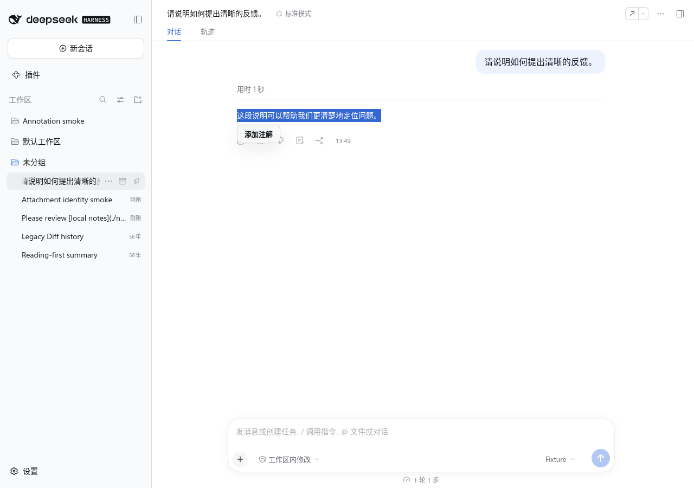
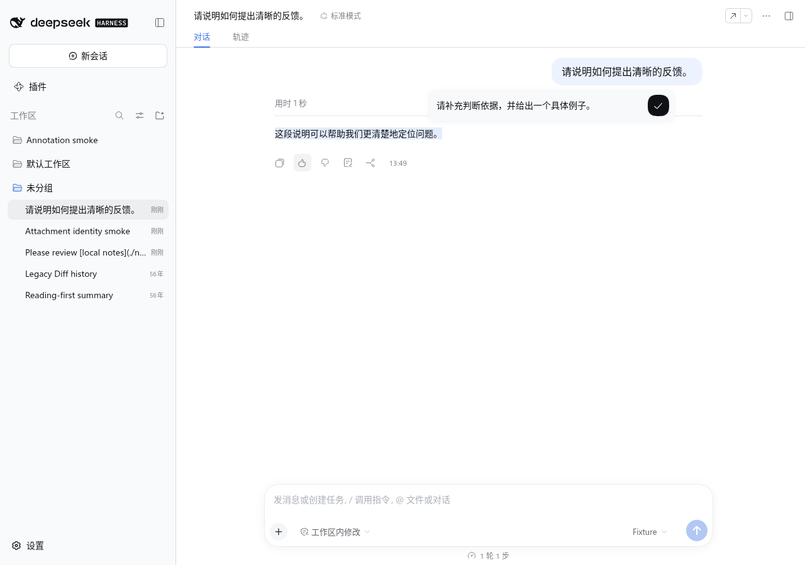
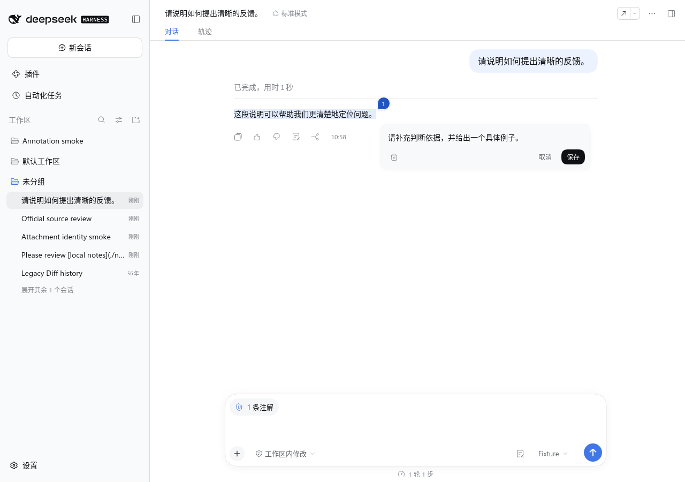
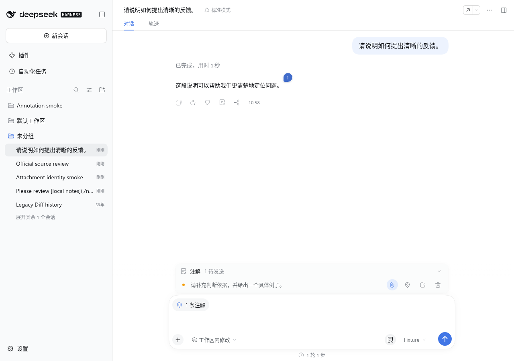
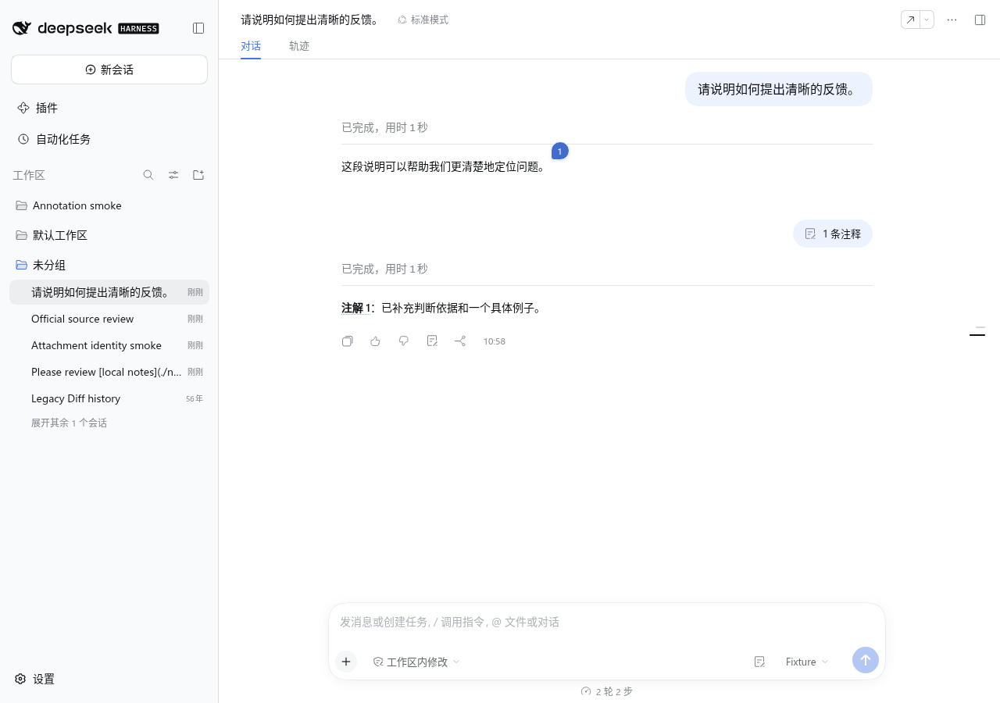
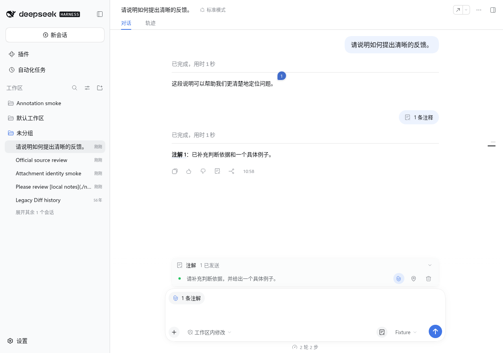
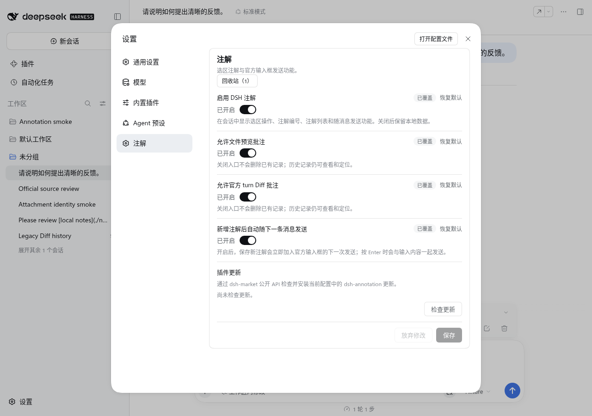

# DSH Annotation

English | [中文](README.zh.md)

Select text in an assistant reply in DeepSeek Harness Web, write an annotation, and send it with the next message; official file previews and official turn-Diff views can also be annotated. Records belong to the current Session. Sent annotations can be attached again without creating duplicate records or source bubbles.

**Host requirement: DeepSeek Harness `0.2.0-rc.1` exactly.** The plugin sends text, images, files, and annotations through the official composer and does not modify Host source.

## Workflow

### 1. Select source text

Select text in one assistant reply and choose **Add annotation**. Overlapping selections create independent annotations directly. The numbered bubble follows the final selected character and scrolls with the reply. Source text has no persistent background or underline; hovering or clicking its bubble highlights the selection.



### 2. Save an annotation

The editor opens below the selection. Press Enter or the check button to save; Shift+Enter inserts a line break. An explicitly saved empty selection note marks the source only. If a new note is empty after trimming whitespace, the first two outside clicks shake its editor and the third cancels it without creating a record. Starting to type in the composer also cancels a blank new editor. The input grows from one to seven lines, then scrolls internally. Click a numbered bubble to view or edit it in the same compact design.





### 3. Review records and attach them

A new annotation attaches to the next message by default without opening the record. The composer's upper-left chip shows the attached count; hover to preview quotes and notes, or click to expand or fold the record. The annotation button left of the model selector and the record's top blank area also expand or fold it. Each row's paperclip controls attachment for this message, and its map pin locates the source with a bright text highlight that fades away. Empty note text stays blank.



### 4. Send and resend

After the official composer sends a message, an annotation count appears above its body. Hover one annotation to preview it or double-click to locate its source. Click a multi-annotation count to expand or fold the list, then locate each source from its row. The record closes automatically when every annotation has been sent. A sent annotation can be attached again with its paperclip; its ID and source bubble remain unchanged.





### 5. Configure

**Settings → Annotations** offers plugin enablement, independent switches for file-preview and official turn-Diff annotations, and automatic attachment after saving. Disabling either official source entry does not delete existing records; with automatic attachment off, a record row's paperclip can attach a note manually. The recycle bin lists Sessions by project and title when Host metadata is available, and filters source types with radio buttons. The settings page also offers plugin updates when dsh-market exposes its public update API. Disabling the plugin removes its UI and composer attachment while retaining local annotation data.



### 6. Review official files and turn Diffs

Open an official file preview to annotate the whole file; text, code, and Markdown previews also accept a selected range. HTML, image, PDF, Office, and spreadsheet previews offer the whole-file action. New records retain the file address, resource version, byte count, coordinates, quote context, and a verified fragment digest without copying the complete file. A temporary loading or Locate failure keeps the saved record and its draft available.

Open the official Diff sidebar from a turn's changed-file card. Select a Diff range or use **Annotate this source** for the whole file. Use the same floating annotation editor and numbered bubbles as assistant replies. **Locate source** opens the official Diff review, waits for its content, and highlights the saved text with the same annotation ID. Source filters appear when the Session has at least two source types; earlier Git Diff records remain read-only.

## Install and compatibility

This checkout targets DSH `0.2.0-rc.1`. The [published `1.1.0` archive](https://github.com/ruisenbai/dsh-annotation/releases/tag/v1.1.0) predates this adaptation; build and verify this checkout before installing it into a disposable Web profile.

### Manual installation

```bash
dsh --version
pnpm install --frozen-lockfile --strict-peer-dependencies
pnpm run verify
pnpm --config.ignoreScripts=true pack --pack-destination artifacts
dsh plugin --profile annotation-dev add ./artifacts/dsh-annotation-1.1.0.tgz
dsh plugin --profile annotation-dev why dsh-annotation
```

The first command must print `0.2.0-rc.1`; the last must show `dsh-annotation@1.1.0` from the locally built archive. Restart the disposable profile's Web Host after installation, then check **Settings → Annotations**. See the [development guide](docs/development.md#install-and-verify) for local checks and the [compatibility guide](docs/compatibility.md) for executed results.

### Install with an AI agent

Give this prompt to an AI agent that can operate your local terminal:

```text
Build this dsh-annotation checkout for DeepSeek Harness Web 0.2.0-rc.1. Run dsh --version and stop if it differs. Run the plugin's frozen install, verify, and local pack commands, then install that local archive into a disposable annotation-dev profile. Confirm dsh plugin --profile annotation-dev why dsh-annotation shows dsh-annotation@1.1.0. Do not use the older published archive or change Host dependencies. Report the commands, version, installation result, and warnings.
```

A new Session without annotations shows no record or empty-state copy. The plugin provides annotation features only; it does not hide reasoning, tool calls, or other conversation content. Record rows show the opinion and status; source type, creation entry, and saved context appear in their details. The `全部/正文/Diff/文件` filter appears when two or more source types exist. Historical Git Diff annotations and snapshots remain read-only. New official turn-Diff annotations use the Diff sidebar; the hover preview has no annotation entry. Earlier hover-origin records remain readable, and Locate opens the sidebar with their saved annotationId. Whole-file file/Diff records require a written opinion and retain their source identity. File previews cover official text, Markdown, code, HTML, image, PDF, Office, Excel, CSV, and TSV renderers; non-text records retain the official preview revision identity rather than inferring bytes from disk.

Unsent annotations, suspended edits, and retries stay in the current browser. Multiple tabs use separate pending records and a browser lock to protect writes. Corrupt or future-version storage is preserved with an error instead of being overwritten by an empty state. Each send freezes its annotations and attachment identities; retries reuse that payload. Migration does not rewrite historical protocols or sent messages. See the [data model](docs/data-model.md) and [privacy guide](docs/privacy.md).

## Limitations

- Unsent drafts do not synchronize across browsers; sent records can be restored from Session history.
- Selections cannot cross assistant messages. Markdown, code, and table locations depend on the Host's current body DOM.
- Without the CSS Custom Highlight API, numbered bubbles and source navigation still work.
- A record becomes processed only after the model returns a valid annotation acknowledgement marker.

[Contributing](CONTRIBUTING.md) · [Changelog](CHANGELOG.md) · [License](LICENSE)
